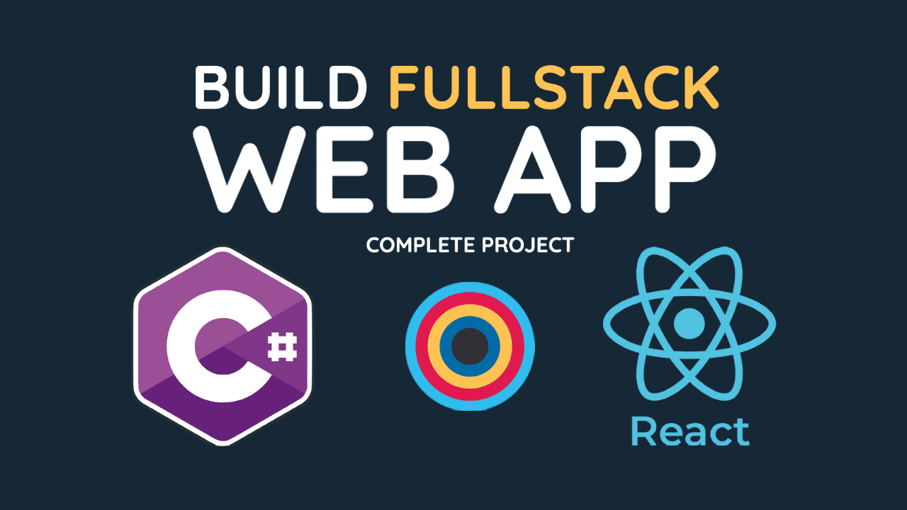

# Full Stack - Dotnet & React



YouTube Link - https://youtu.be/iYDEEdiLWKI

This project shows how to build a typical _frontend backend_ architecture with .NET 5.0 and React. It has a corresponding video on [YouTube](https://youtu.be/iYDEEdiLWKI) where you can learn:

1. How to create a .NET 5.0 project from scratch.
2. How to setup a proper solution structure.
3. How to create a repository, service and API layers.
4. How to setup EF Core and Migrations.
5. How to create unit tests.
6. How to create a react app.
7. How to setup redux.
8. How to create an E2E todo feature.


## Prerequisites:

You need to have the following installed on your machine to follow along with the project:

1. [.NET 5.0](https://dotnet.microsoft.com/download)
2. [Node](https://nodejs.org/en/)
3. [Sqlite](https://www.sqlite.org/index.html)
4. [VS Code](https://code.visualstudio.com/)


# Backend

## Design

| HTTP Verb | API        | Description             | Request Body | Response Body  |
| --------- | :--------- | :---------------------- | :----------- | :------------- |
| GET       | /todo      | Get all todos           | None         | Array of todos |
| GET       | /todo/{id} | Get a todo by id        | None         | Todo           |
| POST      | /todo      | Add a new todo          | Todo         | Todo           |
| PUT       | /todo/{id} | Update an existing todo | Todo         | None           |
| DELETE    | /todo/{id} | Delete a todo           | None         | None           |


## Setup solution structure
1. Create a solution to host all the projects `dotnet new sln --name FS.Todo`
2. Create the Api project `dotnet new webapi --output FS.Todo.Api --framework net5.0`
3. Add the project to the solution `dotnet sln add FS.Todo.Api/FS.Todo.Api.csproj`
4. Trust the HTTPS development certificate `dotnet dev-certs https --trust`
5. Build the solution `dotnet build FS.Todo`
6. Run the project `dotnet run --project FS.Todo.Api/FS.Todo.Api.csproj`
7. Test it out `curl https://localhost:5001/WeatherForecast` or using Postman.


## Setup Debugging
1. C# extension for vs code
2. Change directory to 'backend'
3. Run `.NET: Generate Assets for Build and Debug`
4. Go to `https://localhost:5001/swagger/index.html`
5. C# Extensions for vs code


## Data Project
1. Create a class library project `dotnet new classlib -o FS.Todo.Data`
2. Add the project to the solution `dotnet sln add FS.Todo.Data/FS.Todo.Data.csproj`
3. Add a reference to the new project `dotnet add FS.Todo.Api/FS.Todo.Api.csproj reference FS.Todo.Data/FS.Todo.Data.csproj`
4. Add a reference to the new project from the core project `dotnet add FS.Todo.Core/FS.Todo.Core.csproj reference FS.Todo.Data/FS.Todo.Data.csproj`
5. Install package `dotnet add package Microsoft.EntityFrameworkCore --version 5.0.1`


## Database
1. Installing sqlite
2. VS Code extension
3. Accessing sqlite database


## Migrations
1. Install `dotnet tool install --global dotnet-ef`
2. Install package `dotnet add package Microsoft.EntityFrameworkCore.Design`
3. Add first migration `dotnet ef migrations add InitialCreate`
4. Update database `dotnet ef database update`


## Core Services Project
1. Create a class library project `dotnet new classlib -o FS.Todo.Core`
2. Add the project to the solution `dotnet sln add FS.Todo.Core/FS.Todo.Core.csproj`
3. Add a reference to the new project `dotnet add FS.Todo.Api/FS.Todo.Api.csproj reference FS.Todo.Core/FS.Todo.Core.csproj`


## Api Project
1. Add package: `dotnet add package Microsoft.VisualStudio.Web.CodeGeneration.Design`
2. Install code generator `dotnet tool install -g dotnet-aspnet-codegenerator`
3. Make sure it's up to date `dotnet tool update -g dotnet-aspnet-codegenerator`
4. Scaffold a new controller `dotnet aspnet-codegenerator controller -name TodoController -async -api -m TodoModel -outDir Controllers`
5. Install package `dotnet add package Microsoft.EntityFrameworkCore.InMemory`
6. Install package `dotnet add package Microsoft.EntityFrameworkCore.Sqlite`


## Unit Tests
1. Create a unit test project `dotnet new xunit -o FS.Todo.Tests`
2. Add project to solution `dotnet sln add FS.Todo.Tests/FS.Todo.Tests.csproj`
3. Add reference to core project `dotnet add FS.Todo.Tests/FS.Todo.Tests.csproj reference FS.Todo.Core/FS.Todo.Core.csproj`
4. Add reference to data project `dotnet add FS.Todo.Tests/FS.Todo.Tests.csproj reference FS.Todo.Data/FS.Todo.Data.csproj`
5. Add reference to Api project `dotnet add FS.Todo.Tests/FS.Todo.Tests.csproj reference FS.Todo.Api/FS.Todo.Api.csproj`
6. Install package `dotnet add package Microsoft.EntityFrameworkCore`
7. Install package `dotnet add package Microsoft.EntityFrameworkCore.InMemory`
8. Install package `dotnet add package NSubstitute --version 4.2.2`
9. Install package `dotnet add package Microsoft.AspNetCore.TestHost --version 5.0.1`


## Analyzers
1. Add `IncludeOpenAPIAnalyzers` property in the project file
```xml
<PropertyGroup>
 <IncludeOpenAPIAnalyzers>true</IncludeOpenAPIAnalyzers>
</PropertyGroup>
```
2. Check warnings on build.


# Frontend

## Resources
1. [Create React App](https://create-react-app.dev/)
2. [Materialize CSS](https://materializecss.com/)


## Create the app
1. Run the command `npx create-react-app .`


## Packages
1. redux `npm install redux`
2. react-redux `npm install react-redux`
3. axios `npm install axios`
4. rselect `npm install reselect`
5. redux-thunk `npm install redux-thunk`

YouTube Link - https://youtu.be/iYDEEdiLWKI
